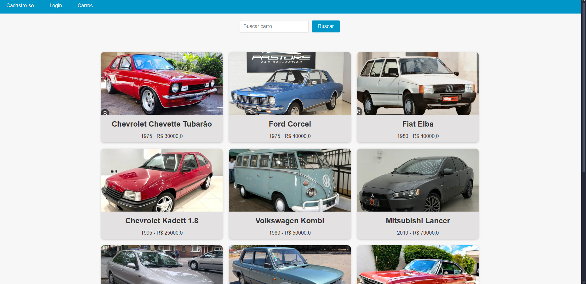
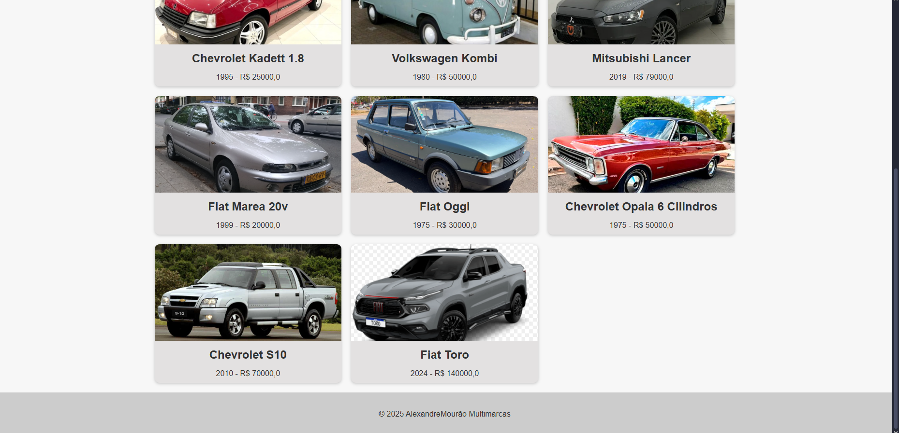
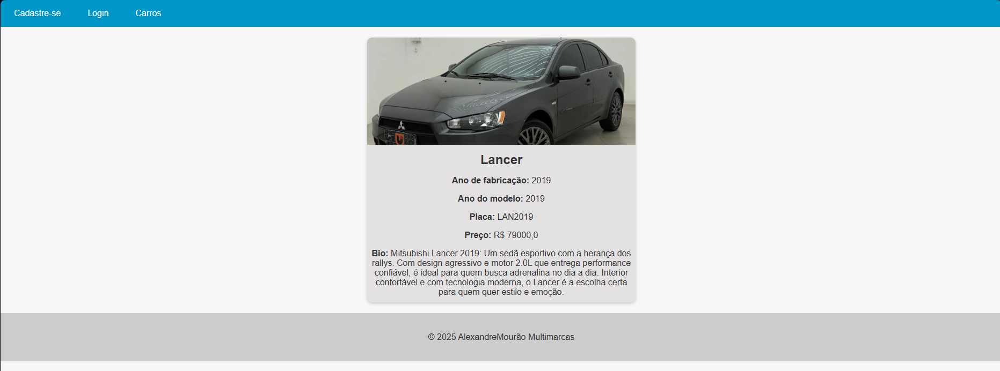
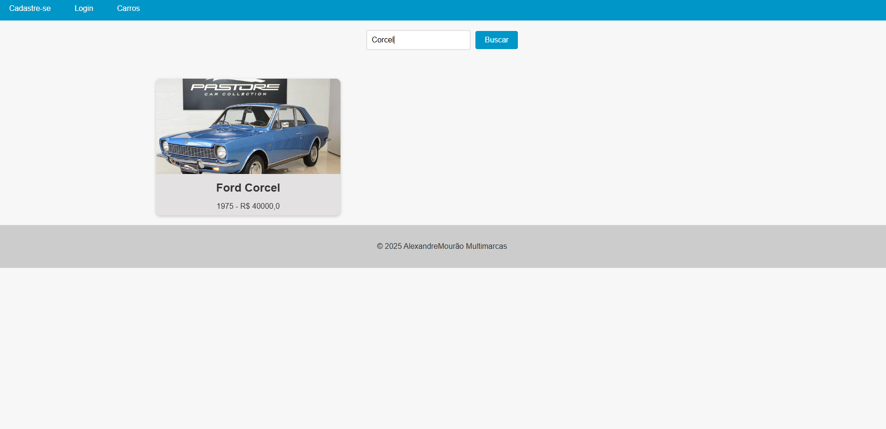
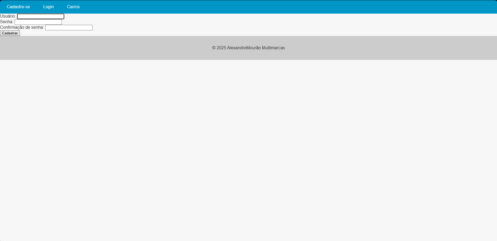
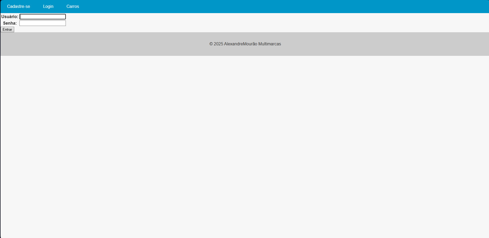
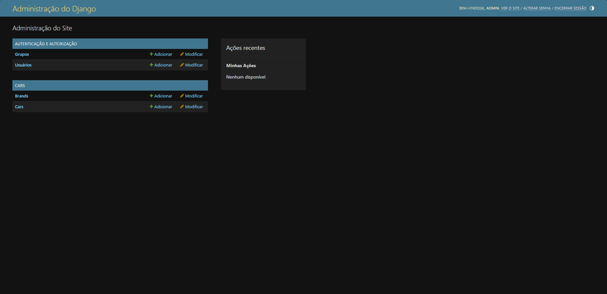
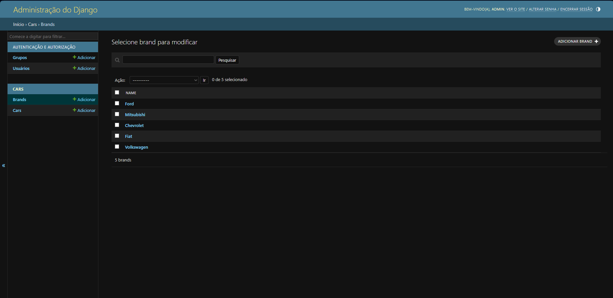
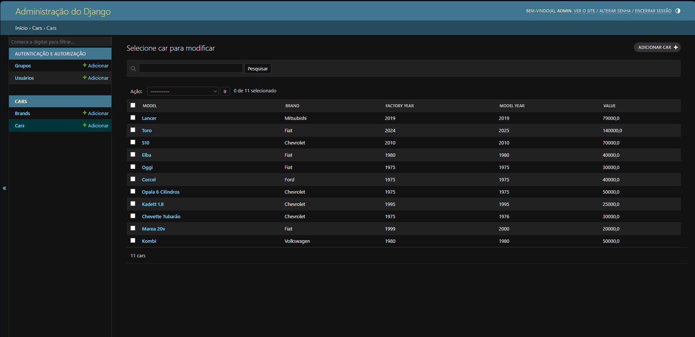

# Cars-Project

Sistema Web para gestão de revenda de carros.  
Permite cadastro de marcas e veículos, autenticação de usuários, integração com API da OpenAI para automação de inventário, banco de dados PostgreSQL e deploy na AWS.

## Funcionalidades
- Cadastro de marcas, carros e vitrine de veículos  
- Registro, login e controle de sessão de usuários  
- Integração com a API da OpenAI para gerar descrição do veículo quando não houver
- Banco de dados PostgreSQL  
- Deploy em servidor AWS

## Tecnologias
- Backend: Python Django 
- Frontend: HTML, CSS, JS  
- Banco de Dados: PostgreSQL  
- Cloud: AWS  
- API: OpenAI

## Pré-requisitos e Instalação
- Este projeto utiliza a API da OpenAI para gerar automaticamente descrições de veículos.
Por questões de segurança, a chave de acesso (OPENAI_API_KEY) não está incluída no repositório.
Isso significa que:
Se você não configurar a chave, ao cadastrar um carro sem preencher manualmente a descrição, o sistema exibirá erro.
Para evitar problemas, você pode sempre preencher a descrição manualmente ou configurar sua própria chave da OpenAI.
- Para adicionar sua OPENAI_API_KEY basta ir na pasta 'openai_api' e depois no arquivo 'client.py'

## Como rodar o projeto
1. Clone o repositório:
   git clone https://github.com/seu-usuario/Cars-Project.git
2. Acesse a pasta de projetos:
   cd Cars-Project
3. Instale as dependências:
   pip install -r requirements.txt
4. Configure as variáveis de ambiente (.env):
   Chave da API da OpenAI
   Configurações do PostgreSQL
   Credenciais da AWS
5. Execute a aplicação:
   python manage.py runserver
6. Acessar no navegador o link http://127.0.0.1:8000/cars

## Screenshots
- 
- 
- 
- 
- 
- 
- 
- 
- 
